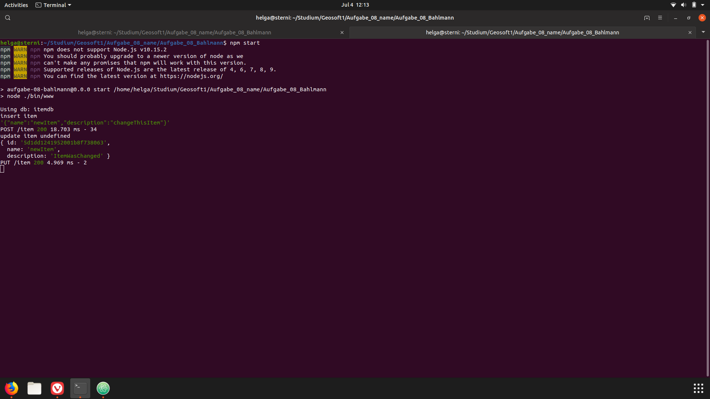
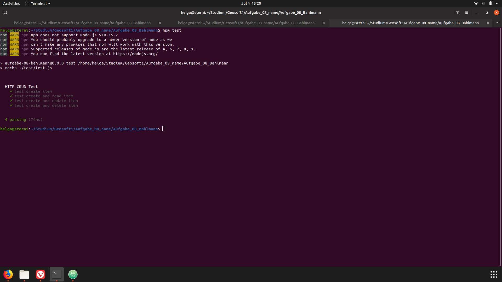
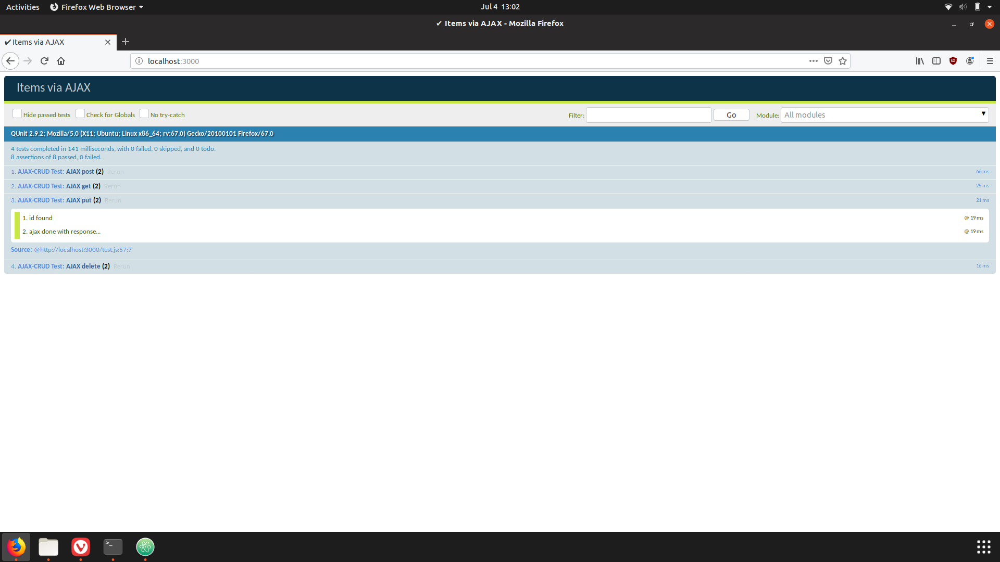
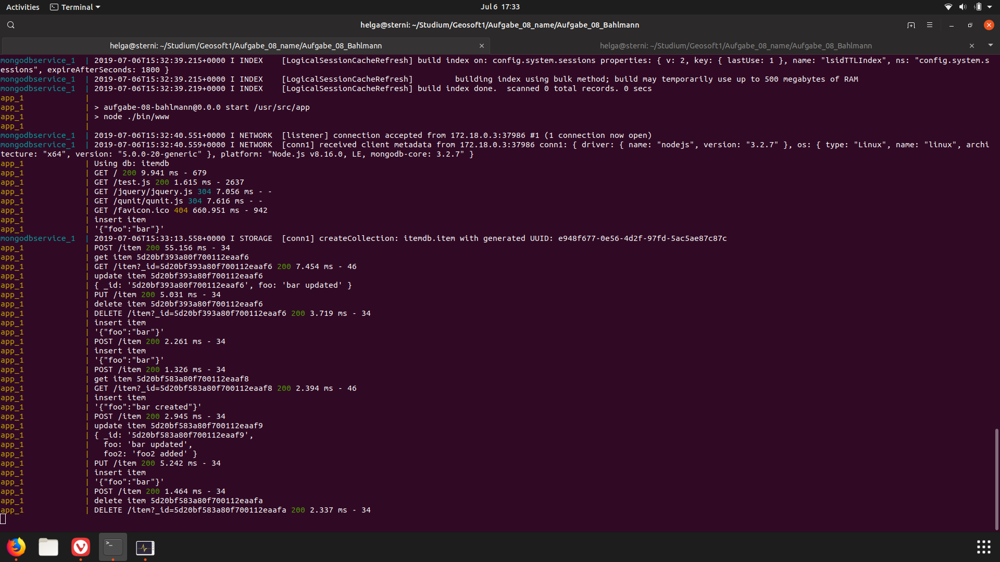
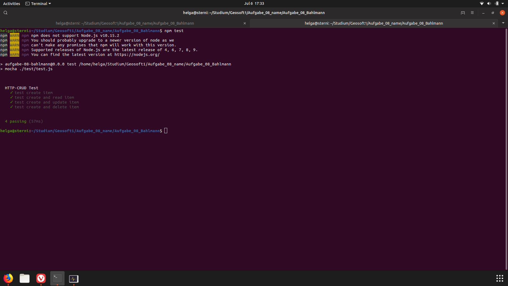

# Aufgabe 8 #
### Geosoftware 1, summer semester 2019 ###
This is the github part of my assignment. See below for a dynamic view of the produced screenshots.

Screenshot of a put request

Successfull mocha tests

Successfull qunit tests

The docker container is running

mocha tests work in docker container too :)
